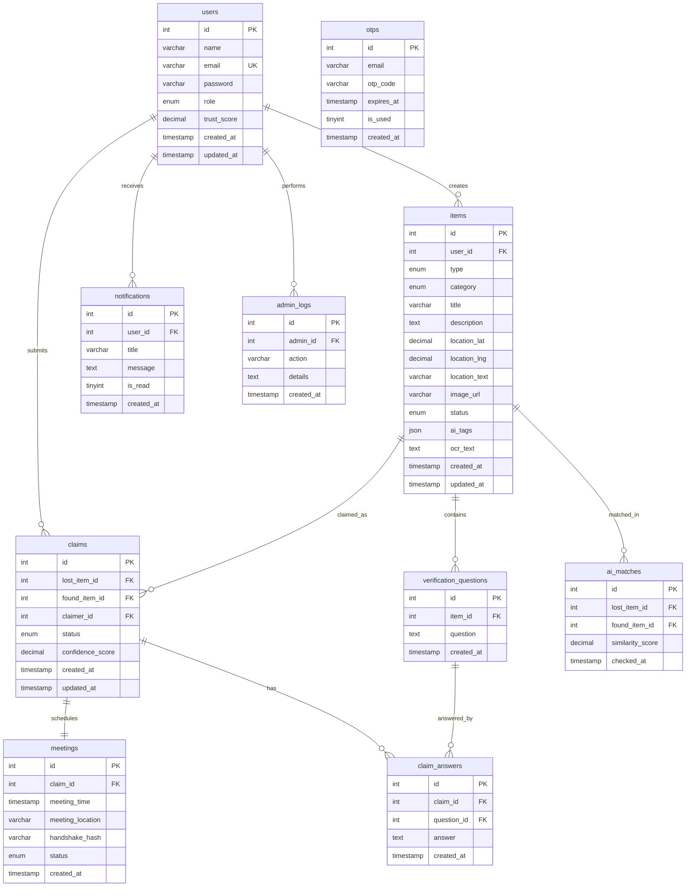

# 🗄️ LostFy Normalized Database ER Diagram & Reference

This directory contains the SQL scripts to initialize and seed the MySQL database for the LostFy platform.

## 📊 Entity Relationship Diagram

The following Mermaid diagram documents the tables, primary/foreign keys, and cardinalities of the database schema:

## 🛠️ Included Files
*   [schema.sql](file:///c:/Users/themd/OneDrive/Desktop/lostfy/database/schema.sql) — DDL script to create database and tables.
